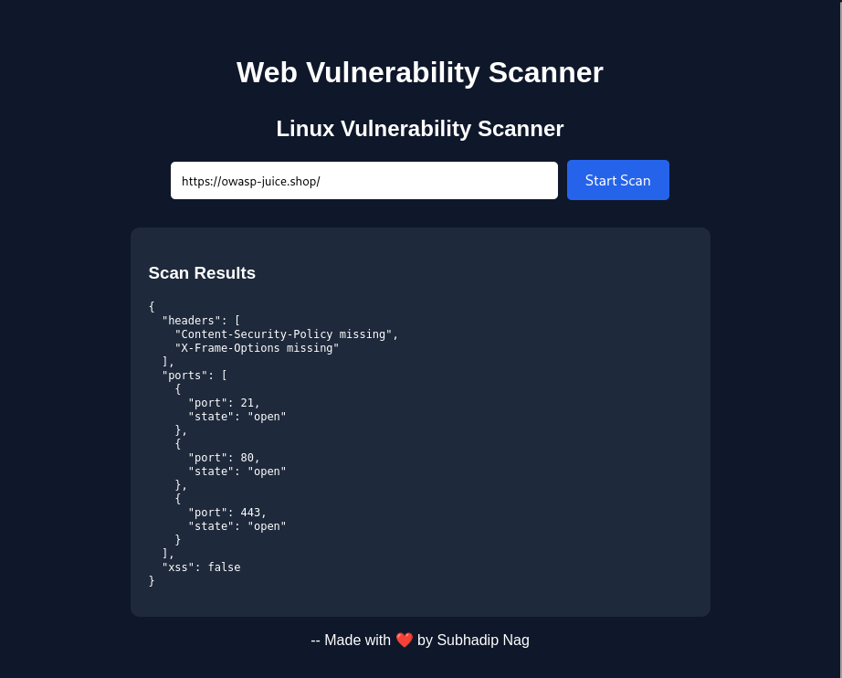

# VulnSec-Scanner

A lightweight full-stack web vulnerability scanner built using Flask and React. The project helps identify common web security issues such as open ports, insecure HTTP headers, and Cross-Site Scripting (XSS) vulnerabilities.

---

# Table of Contents

1. Project Overview
2. Features
3. Technology Stack
4. Project Structure
5. System Requirements
6. Installation Guide
7. Backend Setup
8. Frontend Setup
9. Running the Application
10. Docker Setup
11. API Endpoints
12. Scanner Modules
13. How Scanning Works
14. Usage Guide
15. Testing the Application
16. Reports and Logs
17. Troubleshooting
18. Security Disclaimer
19. Future Improvements
20. Contributing
21. License

---

# 1. Project Overview

VulnSec-Scanner is a web-based vulnerability assessment tool designed for educational purposes, cybersecurity practice, and beginner penetration testing workflows.

The application provides:

* Port scanning
* HTTP security header analysis
* Basic XSS vulnerability detection
* Web-based dashboard interface
* Docker support
* REST API backend

This project demonstrates how modern web applications can integrate security scanning functionalities using Python and JavaScript technologies.

---

# 2. Features

## Core Features

### Port Scanner

* Detects open ports on target systems
* Helps identify exposed services
* Useful for reconnaissance and network analysis

### Header Scanner

* Checks HTTP response headers
* Identifies missing security headers
* Detects weak or insecure configurations

### XSS Scanner

* Performs basic reflected XSS testing
* Sends payloads to forms and parameters
* Detects potential Cross-Site Scripting issues

### Full Stack Web Interface

* React frontend
* Flask REST API backend
* Easy-to-use scanning dashboard

### Docker Support

* Containerized deployment
* Easy setup across operating systems
* Portable development environment

---

# 3. Technology Stack

## Frontend

* React.js
* Axios
* HTML/CSS
* JavaScript

## Backend

* Flask
* Python
* Flask Blueprints
* Requests Library
* Socket Programming

## Containerization

* Docker
* Docker Compose

---

# 4. Project Structure

```bash
vuln_scanner/
│
├── backend/
│   ├── database/
│   ├── reports/
│   ├── routes/
│   ├── scanners/
│   ├── app.py
│   ├── requirements.txt
│   └── Dockerfile
│
├── frontend/
│   ├── public/
│   ├── src/
│   ├── Dockerfile
│   └── README.md
│
├── docker-compose.yml
└── README.md
```

---

# 5. System Requirements

## Minimum Requirements

* 4 GB RAM
* 10 GB free storage
* Internet connection

## Supported Operating Systems

* Kali Linux
* Ubuntu
* Debian
* Windows (with WSL or Docker)
* macOS

## Required Software

### Mandatory

* Python 3.10+
* Node.js 18+
* npm
* Git

### Optional

* Docker
* Docker Compose

---

# 6. Installation Guide

## Step 1: Clone the Repository

```bash
git clone https://github.com/your-username/VulnSec-Scanner.git
```

## Step 2: Move Into Project Directory

```bash
cd VulnSec-Scanner/vuln_scanner
```

---

# 7. Backend Setup

Move into backend directory:

```bash
cd backend
```

## Create Virtual Environment

### Linux/macOS

```bash
python3 -m venv venv
source venv/bin/activate
```

### Windows

```bash
python -m venv venv
venv\Scripts\activate
```

---

## Install Backend Dependencies

```bash
pip install -r requirements.txt
```

---

## Example requirements.txt

```txt
Flask
flask-cors
requests
beautifulsoup4
```

---

## Start Backend Server

```bash
python app.py
```

Expected Output:

```bash
Running on http://127.0.0.1:5000
```

---

# 8. Frontend Setup

Open another terminal.

Move into frontend directory:

```bash
cd frontend
```

---

## Install Frontend Dependencies

```bash
npm install
```

---

## Start React Frontend

```bash
npm start
```

Expected Output:

```bash
Compiled successfully!
```

Frontend runs on:

```txt
http://localhost:3000
```

---

# 9. Running the Application

## Start Backend

```bash
cd backend
python app.py
```

## Start Frontend

```bash
cd frontend
npm start
```

---

## Access the Application

Open browser:

```txt
http://localhost:3000
```

---

# 10. Docker Setup

Docker simplifies installation and deployment.

---

## Install Docker

### Kali Linux

```bash
sudo apt update
sudo apt install docker.io docker-compose -y
```

Enable Docker:

```bash
sudo systemctl enable docker
sudo systemctl start docker
```

Verify:

```bash
docker --version
```

---

## Build and Run Containers

From project root:

```bash
docker-compose up --build
```

Run in background:

```bash
docker-compose up -d
```

Stop containers:

```bash
docker-compose down
```

---

# 11. API Endpoints

## Scan Endpoint

### POST Request

```http
POST /scan
```

### Example Request Body

```json
{
  "target": "example.com"
}
```

### Example Response

```json
{
  "ports": [80, 443],
  "headers": {
    "X-Frame-Options": "Missing"
  },
  "xss": "Potential vulnerability detected"
}
```

---

# 12. Scanner Modules

## Port Scanner

### Purpose

Detects open TCP ports on target systems.

### Common Ports Checked

| Port | Service |
| ---- | ------- |
| 21   | FTP     |
| 22   | SSH     |
| 23   | Telnet  |
| 25   | SMTP    |
| 53   | DNS     |
| 80   | HTTP    |
| 443  | HTTPS   |
| 3306 | MySQL   |

### File

```bash
backend/scanners/port_scanner.py
```

---

## Header Scanner

### Purpose

Checks HTTP security headers.

### Headers Tested

* Content-Security-Policy
* X-Frame-Options
* Strict-Transport-Security
* X-Content-Type-Options
* Referrer-Policy

### File

```bash
backend/scanners/header_scanner.py
```

---

## XSS Scanner

### Purpose

Detects reflected XSS vulnerabilities.

### Example Payload

```html
<script>alert('XSS')</script>
```

### File

```bash
backend/scanners/xss_scanner.py
```

---

# 13. How Scanning Works

## Step-by-Step Workflow

1. User enters target URL/IP
2. React frontend sends API request
3. Flask backend receives request
4. Backend calls scanner modules
5. Results are collected
6. JSON response sent to frontend
7. Frontend displays vulnerabilities

---

# 14. Usage Guide

## Example 1: Scan a Website

Enter:

```txt
https://example.com
```

Click:

```txt
Start Scan
```

Results displayed:

* Open ports
* Missing security headers
* XSS findings

---

## Example 2: Scan Localhost

```txt
127.0.0.1
```

Useful for:

* Testing local servers
* Learning cybersecurity
* Debugging web applications

---

# 15. Testing the Application

## Backend Testing

Use curl:

```bash
curl -X POST http://127.0.0.1:5000/scan \
-H "Content-Type: application/json" \
-d '{"target":"example.com"}'
```

---

## Frontend Testing

1. Open frontend
2. Enter target
3. Run scan
4. Verify results

---

# 16. Reports and Logs

## Reports Directory

```bash
backend/reports/
```

Purpose:

* Save scan outputs
* Store vulnerability reports
* Export findings

---

## Database Directory

```bash
backend/database/
```

Can be used for:

* User management
* Report history
* Scan logs
* Authentication

---

# 17. Troubleshooting

## Problem: Backend Not Starting

### Solution

Install dependencies:

```bash
pip install -r requirements.txt
```

Check Python version:

```bash
python --version
```

---

## Problem: npm start Fails

### Solution

Delete node_modules:

```bash
rm -rf node_modules package-lock.json
npm install
```

---

## Problem: CORS Error

### Solution

Install Flask-CORS:

```bash
pip install flask-cors
```

Add:

```python
from flask_cors import CORS
CORS(app)
```

---

## Problem: Port Already in Use

### Linux

```bash
sudo lsof -i :5000
kill -9 PID
```

### Windows

```bash
netstat -ano | findstr :5000
```

---

## Problem: Docker Issues

Restart Docker:

```bash
sudo systemctl restart docker
```

---

# 18. Security Disclaimer

This project is developed strictly for:

* Educational purposes
* Ethical hacking practice
* Security research
* Authorized penetration testing

Do NOT scan systems without permission.
Unauthorized scanning may violate laws and regulations.

#  The developer is not responsible for misuse of this project.

---

# 19. Future Improvements

Potential enhancements:

* SQL Injection Scanner
* CSRF Detection
* Authentication System
* PDF Report Export
* Real-time Dashboard
* AI-powered Vulnerability Analysis
* Multi-threaded Scanning
* CVE Database Integration
* OWASP Top 10 Support

---

# 20. Contributing

Contributions are welcome.

## Steps

1. Fork repository
2. Create new branch
3. Make changes
4. Commit updates
5. Push branch
6. Open Pull Request

---

# 21. License

This project is licensed under the MIT License.

---

# Commands Summary

## Frontend

```bash
cd frontend
npm install
npm start
```

## Docker

```bash
docker-compose up --build
```

---

# Dashboard
OWASP Juice Shop is safe for scanning!


---

# Author

Developed by SubhadipNag

GitHub: [https://github.com/SubhadipNag](https://github.com/SubhadipNag)

---

# Final Notes

VulnSec-Scanner is an educational cybersecurity project intended to help beginners understand how web vulnerability scanners work internally.

It combines frontend development, backend APIs, networking concepts, and cybersecurity fundamentals into one practical learning project.
